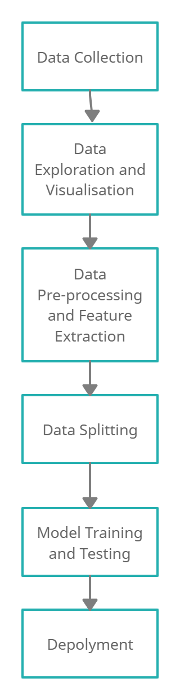

# Cyber-Troll Prediction Service

This is a web application designed to show the project structure for a machine learning model deployed using flask. This project features a machine learning model that has been trained to detect whether or not an online comment is a `Cyber-Troll` or `Non Cyber-Troll`. This application acts as an interface for a user to submit new queries. The machine learning model was built training Support Vector Machine (SVM) model.

The SVM and BoW models are used in the production and testing setting in order to be able to predict user-submitted queries, so they can be serialized via python's pickle functionality and stored within the `/model_assets` folder. 

In order to detect whether or not an online comment is from a cyber troll, you can visit https://cybertroll-dipti-101803601.herokuapp.com/ and submit the review, to recieve predictions through a simple user interface. 

I have applied a supervised learning model to perform binary classification on the given set of reviews. Accuracy is used to measure the performance of the trained model.

The dataset used for the training of the model has 20000+ reviews. The train accuracy is observed to be 0.97 and test accuracy is 0.85.

## Methodology

* Data Collection: cyber_data.json contain all the reviews that are used for training and testing of the model in `model_dev`.
* Data Exploration and Visualisation: A bar graph of Non-Cyber-Agressive and Cyber-Agressive is plotted to view the amount of reviews. Further 10 examples of both labels 0(Non-Cyber-Agressive) and 1(Cyber-Agressive) followed by most common words used in both type of reviews.
* Data Pre-processing and Feature Extraction: The reviews are normalized,lemmatized, and all the stopwords are removed from the dataframe. Further CountVectorizer and TfIdf is used for feature extraction, that will be used in model training.
* Data Splitting: The cleaned text is divided for training and testing.
* Model Training and Testing: I am using SVM model for training of the dataframe and further GridSearch is also applied. Final performance is measured on the basis of accuracy of training and testing. The trained model is saved in a pickle file which is further used for prediction from the user input.
* Deployment: Using features provided by flask I have integrated the template of an html page and a python file which predicts the result of the given review to be `Cyber-Troll` or `Non Cyber-Troll`. Further for deployment of the project online, the platform of heroku is used and all the requirements are fulfilled for successful deployment of the web app. Hence, now using the link https://cybertroll-dipti-101803601.herokuapp.com/ , the final product can be used from the web.

## Novelty
- Performed *Hyperparameter Tuning* on the trained model
SVM(Support Vector Machine) parameter: 'C' used for error control
- Used *BeautifulSoup* for data preprocessing
